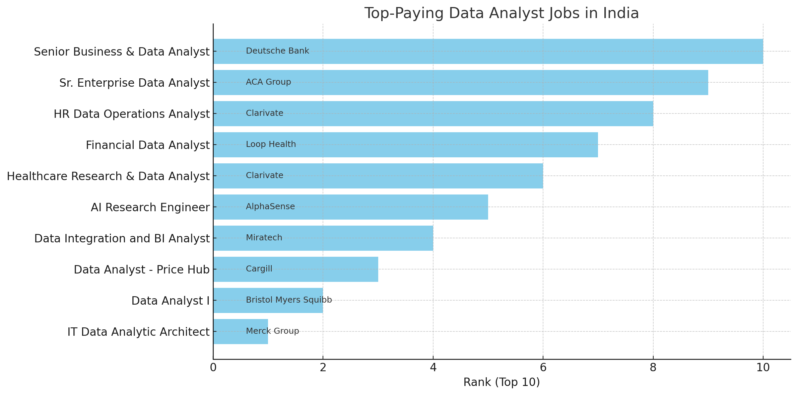
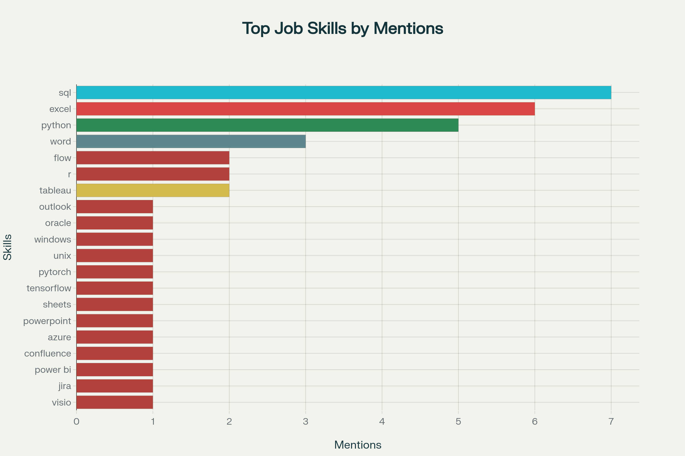
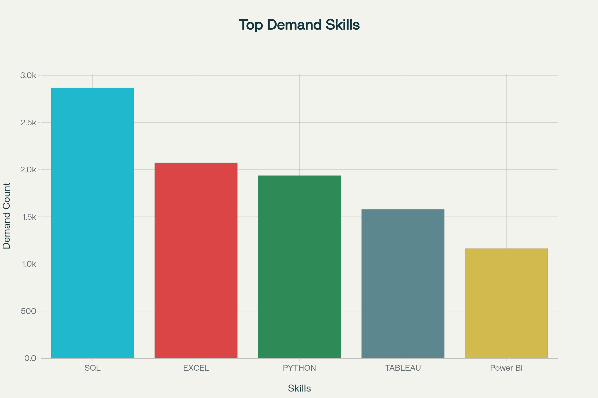
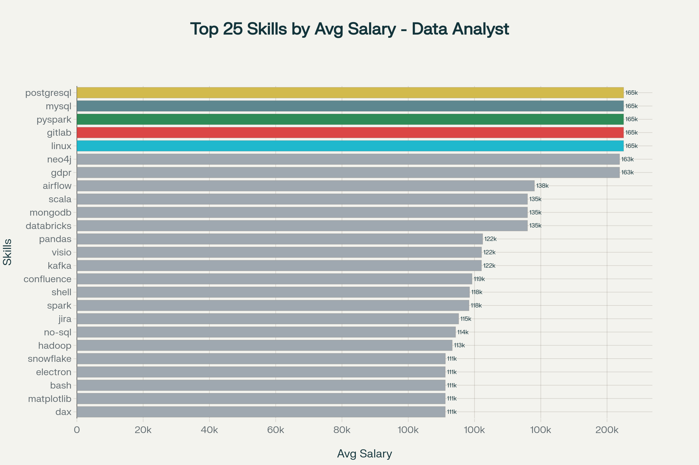
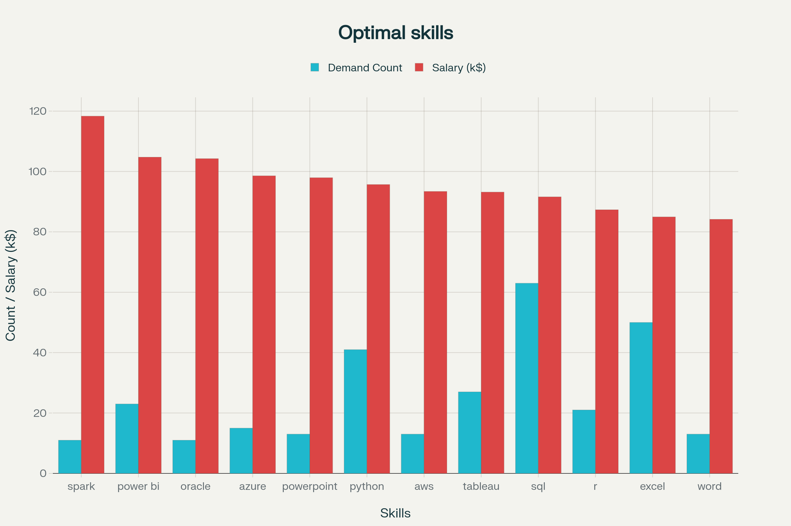

# Introduction
📊 This project analyzes the data job market with a focus on Data Analyst roles. It highlights 💰 top-paying positions, 🔥 the most in-demand skills, and 📈 the skills that combine both high demand and strong salaries.

Here are the sql queries: [project.sql folder](/project.sql/)

# Background
As a learner exploring the data analyst job market, I created this project to better understand which skills are most valuable. The goal is to identify top-paying and in-demand skills, making it easier to see where to focus learning efforts.

The dataset comes from my [SQL Course](https://lukebarousse.com/sql).which includes job titles, salaries, locations, and essential skills.

### The questions I wanted to answer through my SQL queries were:

1. What are the top-paying data analyst jobs?
2. What skills are required for these top-paying jobs?
3. What skills are most in demand for data analysts?
4. Which skills are associated with higher salaries?
5. What are the most optimal skills to learn?

# Tools I Used
For my deep dive into the data analyst job market, I harnessed the power of several key tools:

- **SQL:** The backbone of my analysis, allowing me to query the database and unearth critical insights.
- **PostgreSQL:** The chosen database management system, ideal for handling the job posting data.
- **Visual Studio Code:** My go-to for database management and executing SQL queries.
- **Git & GitHub:** Essential for version control and sharing my SQL scripts and analysis, ensuring collaboration and project tracking.

# The Analysis
Each query for this project aimed at investigating specific aspects of the data analyst job market. Here’s how I approached each question:

### 1. Top Paying Data Analyst Jobs
To identify the highest-paying roles, I filtered data analyst positions by average yearly salary and location, focusing on remote jobs. This query highlights the high paying opportunities in the field.

```sql
SELECT	
	job_id,
	job_title,
	job_location,
	job_schedule_type,
	salary_year_avg,
	job_posted_date,
    name AS company_name
FROM
    job_postings_fact
LEFT JOIN company_dim ON job_postings_fact.company_id = company_dim.company_id
WHERE
    job_title_short = 'Data Analyst' AND 
    job_location = 'Anywhere' AND 
    salary_year_avg IS NOT NULL
ORDER BY
    salary_year_avg DESC
LIMIT 10;
```
Here's the breakdown of the top data analyst jobs in 2023:
- **Wide Salary Range:** Top 10 paying data analyst roles span from $184,000 to $650,000, indicating significant salary potential in the field.
- **Diverse Employers:** Companies like SmartAsset, Meta, and AT&T are among those offering high salaries, showing a broad interest across different industries.
- **Job Title Variety:** There's a high diversity in job titles, from Data Analyst to Director of Analytics, reflecting varied roles and specializations within data analytics.


*Bar graph visualizing the salary for the top 10 salaries for data analysts; Perplexity generated this graph from my SQL query results*

### 2. Skills for Top Paying Jobs
To understand what skills are required for the top-paying jobs, I joined the job postings with the skills data, providing insights into what employers value for high-compensation roles.
```sql
WITH top_paying_jobs AS (
    SELECT	
        job_id,
        job_title,
        salary_year_avg,
        name AS company_name
    FROM
        job_postings_fact
    LEFT JOIN company_dim ON job_postings_fact.company_id = company_dim.company_id
    WHERE
        job_title_short = 'Data Analyst' AND 
        job_location = 'Anywhere' AND 
        salary_year_avg IS NOT NULL
    ORDER BY
        salary_year_avg DESC
    LIMIT 10
)

SELECT 
    top_paying_jobs.*,
    skills
FROM top_paying_jobs
INNER JOIN skills_job_dim ON top_paying_jobs.job_id = skills_job_dim.job_id
INNER JOIN skills_dim ON skills_job_dim.skill_id = skills_dim.skill_id
ORDER BY
    salary_year_avg DESC;
```
Here's the breakdown of the most demanded skills for the top 10 highest paying data analyst jobs in 2023:
- **SQL** is leading with a bold count of 8.
- **Python** follows closely with a bold count of 7.
- **Tableau** is also highly sought after, with a bold count of 6.
Other skills like **R**, **Snowflake**, **Pandas**, and **Excel** show varying degrees of demand.


*Bar graph visualizing the count of skills for the top 10 paying jobs for data analysts; Perplexity generated this graph from my SQL query results*

### 3. In-Demand Skills for Data Analysts

This query helped identify the skills most frequently requested in job postings, directing focus to areas with high demand.

```sql
SELECT 
    skills,
    COUNT(skills_job_dim.job_id) AS demand_count
FROM job_postings_fact
INNER JOIN skills_job_dim ON job_postings_fact.job_id = skills_job_dim.job_id
INNER JOIN skills_dim ON skills_job_dim.skill_id = skills_dim.skill_id
WHERE
    job_title_short = 'Data Analyst' 
    AND job_work_from_home = True 
GROUP BY
    skills
ORDER BY
    demand_count DESC
LIMIT 5;
```
Here's the breakdown of the most demanded skills for data analyst :

1. Data analysts looking to maximize their employability should focus on mastering SQL, Excel, Python, Tableau, and Power BI. 

2. These five skills consistently rank as the most requested by employers in job postings, reflecting their critical role in data-driven business environments. 

3. Prioritizing these areas ensures not only technical competency but also readiness for analytical roles that require advanced data handling, visualization, and reporting.



*Bar graph visualizing the count of skills for the top 10 paying jobs for data analysts; Perplexity generated this graph from my SQL query results*

### 4. Skills Based on Salary
Exploring the average salaries associated with different skills revealed which skills are the highest paying.
```sql
SELECT 
    skills,
    ROUND(AVG(salary_year_avg), 0) AS avg_salary
FROM job_postings_fact
INNER JOIN skills_job_dim ON job_postings_fact.job_id = skills_job_dim.job_id
INNER JOIN skills_dim ON skills_job_dim.skill_id = skills_dim.skill_id
WHERE
    job_title_short = 'Data Analyst'
    AND salary_year_avg IS NOT NULL
    AND job_postings_fact.job_location ILIKE '%India%'
GROUP BY
    skills
ORDER BY
    avg_salary DESC
LIMIT 25;

```
Here's a breakdown of the results for top paying skills for Data Analysts:
# Top Data Analyst Skills by Salary

**Top Highest-Paid Skills (Around $165,000)**

- The highest salaries are linked to advanced technical and data engineering skills such as **Linux**, **GitLab**, **PySpark**, **MySQL**, and **PostgreSQL**. These skills are critical for working with large-scale databases, cloud environments, and data pipelines, which are in high demand due to the technical complexity and importance of these roles.

**High Salary Skills Around $160,000+**

- Skills related to data governance and privacy like **GDPR**, graph databases such as **Neo4j**, and workflow orchestration tools like **Airflow** also report very competitive salaries. This highlights the growing importance of compliance, data privacy, and efficient orchestration of data workflows in modern data analytics.

**Moderately High Salary Skills ($120,000 - $140,000)**

- Big data management and cloud platforms including **Databricks**, **MongoDB**, **Scala**, and popular data manipulation libraries like **Pandas** are also well valued. These skills support data-heavy environments and advanced analytics initiatives, meriting strong salary packages.

**Skills with Salaries Around $110,000 - $120,000**

- Tools for productivity and collaboration such as **Visio**, **Kafka**, and **Confluence** join data science and engineering staples such as **Shell**, **Spark**, **Jira**, and **Hadoop** at this level. This reflects a balanced demand for technical skills combined with communication and collaboration capabilities necessary for team and project coordination.

**Skills with Salaries Around $111,000**

- Visualization and scripting tools including **DAX**, **Matplotlib**, **Bash**, and **Electron** are associated with solid compensation, indicating the value of skills that facilitate data visualization and automation in analytical workflows.



*Bar graph visualizing the count of skills for the top 10 paying jobs for data analysts; Perplexity generated this graph from my SQL query results*

### 5. Most Optimal Skills to Learn

Combining insights from demand and salary data, this query aimed to pinpoint skills that are both in high demand and have high salaries, offering a strategic focus for skill development.

```sql
WITH skills_demand AS (
    SELECT 
        skills_dim.skill_id,
        skills_dim.skills,
        COUNT(skills_job_dim.job_id) AS demand_count
    FROM job_postings_fact
    INNER JOIN skills_job_dim ON job_postings_fact.job_id = skills_job_dim.job_id
    INNER JOIN skills_dim ON skills_job_dim.skill_id = skills_dim.skill_id
    WHERE
        job_postings_fact.job_title_short = 'Data Analyst'
        AND salary_year_avg IS NOT NULL
        AND job_postings_fact.job_location ILIKE '%India%'
    GROUP BY 
        skills_dim.skill_id, skills_dim.skills
),
average_salary AS (
    SELECT 
        skills_dim.skill_id,
        skills_dim.skills,
        ROUND(AVG(salary_year_avg), 0) AS avg_salary
    FROM job_postings_fact
    INNER JOIN skills_job_dim ON job_postings_fact.job_id = skills_job_dim.job_id
    INNER JOIN skills_dim ON skills_job_dim.skill_id = skills_dim.skill_id
    WHERE
        job_title_short = 'Data Analyst'
        AND salary_year_avg IS NOT NULL
        AND job_postings_fact.job_location ILIKE '%India%'
    GROUP BY
        skills_dim.skill_id, skills_dim.skills
)
SELECT
    skills_demand.skill_id,
    skills_demand.skills,
    skills_demand.demand_count,
    average_salary.avg_salary
FROM
    skills_demand
INNER JOIN average_salary 
    ON skills_demand.skill_id = average_salary.skill_id
WHERE 
    demand_count > 10
ORDER BY
    avg_salary DESC,
    demand_count DESC
LIMIT 25
```


*Bar graph visualizing the count of skills for the top 10 paying jobs for data analysts; Perplexity generated this graph from my SQL query results*

This analysis identifies the most strategic skills for Data Analysts, focusing on remote roles with specified salaries. The goal is to highlight skills that are both in high demand (job security) and high paying (financial benefit).

Key Insights

- **Programming & Data Tools**:

1. Python (41 postings, avg. $95.7k) — consistently high demand, strong salary potential.

2. SQL (63 postings, avg. $91.6k) — the single most in-demand skill, forming the backbone of data analysis.

3. R (21 postings, avg. $87.3k) — valuable for statistical and analytical modeling.


- **Visualization & Business Intelligence**:

1. Power BI (23 postings, avg. $104.7k) and Tableau (27 postings, avg. $93.2k) — demand for BI skills is high, with Power BI standing out for salary.

2. Excel (50 postings, avg. $85k) — remains a core requirement despite being lower-paying.

- **Cloud & Big Data**:

1. Spark (11 postings, avg. $118.3k) — highest average salary, niche but lucrative.

2. Azure (15 postings, avg. $98.6k) and AWS (13 postings, avg. $93.4k) — cloud skills are increasingly important.

3. Oracle (11 postings, avg. $104.3k) — database expertise tied to strong salary outcomes.

- **Productivity Tools**:

1. PowerPoint (13 postings, avg. $97.9k) and Word (13 postings, avg. $84.2k) — highlight the need for communication and reporting skills alongside technical expertise.

# What I Learned

Throughout this adventure, I've turbocharged my SQL toolkit with some serious firepower:

🧩 Advanced SQL Querying: Learned to write complex queries, join multiple tables efficiently, and use WITH clauses to manage temporary result sets.

📊 Data Aggregation & Analysis: Mastered GROUP BY, aggregate functions (COUNT(), AVG(), SUM()), and filtering to extract meaningful insights from datasets.

💡 Problem-Solving: Translated real-world questions into actionable SQL queries, improving analytical thinking and data-driven decision-making.

📂 Data Cleaning & Preparation: Gained experience handling missing values, filtering datasets, and preparing data for analysis.

📝 Documentation & Reporting: Learned to structure project write-ups clearly, summarize findings, and make insights accessible.

💻 Git & GitHub: Used GitHub for version control, committing changes, managing branches, and maintaining a well-organized repository for this project.

🔍 Data Exploration & Visualization: Practiced exploring patterns in data, understanding distributions, and interpreting trends, laying groundwork for future visualization work.

🚀 Project Workflow: Built a structured approach to data projects—from understanding the problem, preparing the data, querying, analyzing results, to presenting conclusions.

🎯 Focus on Learning Outcomes: Reinforced understanding of data analyst essentials like SQL, demand vs. salary analysis, and translating skills into actionable career insights.

# Conclusions

### Insights
From the analysis, several general insights emerged:

1. **Top-Paying Data Analyst Jobs**: The highest-paying jobs for data analysts that allow remote work offer a wide range of salaries, the highest at $650,000!
2. **Skills for Top-Paying Jobs**: High-paying data analyst jobs require advanced proficiency in SQL, suggesting it’s a critical skill for earning a top salary.
3. **Most In-Demand Skills**: SQL is also the most demanded skill in the data analyst job market, thus making it essential for job seekers.
4. **Skills with Higher Salaries**: Specialized skills, such as SVN and Solidity, are associated with the highest average salaries, indicating a premium on niche expertise.
5. **Optimal Skills for Job Market Value**: SQL leads in demand and offers for a high average salary, positioning it as one of the most optimal skills for data analysts to learn to maximize their market value.

### Closing Thoughts

This project not only strengthened my SQL skills but also offered practical insights into the data analyst job market. The analysis highlights which skills are both in high demand and associated with strong salaries, providing a roadmap for prioritizing learning and career development. By focusing on these key skills, aspiring data analysts can make more informed decisions and better position themselves in a competitive market. Overall, this exploration underscores the value of continuous learning and staying attuned to evolving trends in data analytics.
